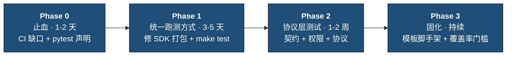
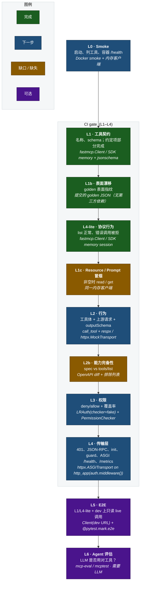

# MCP Servers — 测试改进计划

> 状态：草案，供团队对齐  

## 1. 背景：现状（实测）

六个 Server 的测试套件已在本地跑过。**约 1,426 条测试，全部通过。**

| Server | 测试数 | CI 是否跑？ | 本地 `uv sync` 是否可用？ |
|---|---|---|---|
| cleanroom-intelligence-mcp | 814 | 是 | 否 — 构建失败 |
| cleanroom-mcp | 217（+2 skipped） | 是 | 否 — 构建失败 |
| shared-internal-tools-mcp | 185 | 是 | 部分 — 缺 pytest |
| **liveramp-product-mcp** | **158** | **否 — 未进 CI** | 是 |
| billing-oc-mcp | 49 | 是 | 是 |
| ae-mcp | 3 | 是 | 否 — 无 `pyproject.toml` |
| template | 0 | — | — |

**结论：** 我们缺的不是测试数量，而是*统一的运行方式*、*完整的 CI 覆盖*，以及*对 MCP 协议层的任何校验*。

## 2. 目标与成功标准

| 目标 | 验收标准 |
|---|---|
| CI 无缺口 | 每个可部署 Server 都有测试阶段；任何镜像都必须先跑完套件才能构建部署 |
| 一条命令跑全量 | 仓库根目录 `make test` 跑齐所有 Server；新人 5 分钟可上手 |
| MCP 协议被验证 | 每个 Server 都有契约、权限、协议测试；零 skip |
| 新 Server 自带测试 | `create-server.sh` 脚手架即含 smoke 与契约测试 |

## 4. 分阶段计划

### Phase 0 — 止血（1–2 天）

改动小，见效快。

| # | 任务 | 验收 |
|---|---|---|
| 0.1 | **已完成** — 在 `Jenkinsfile` 增加 `Test liveramp-product-mcp` 阶段 | CI 跑其 203 条测试（158 既有 + 45 协议）。已在等价于 `python:3.11-slim` 的新鲜环境本地验证；需一次真实 CI 确认 |
| 0.1a | **后续（做 0.1 时发现）：** 已提交的 `servers/liveramp-product-mcp/uv.lock` 过期 — 缺少 SDK 现已依赖的 `prometheus-client`。因此 CI 阶段用普通 `uv sync`（非 `--frozen`），与 Dockerfile 一致。应重新生成并提交 lock，再把 CI 切到 `uv sync --frozen` 以保证可复现 | `uv sync --frozen` 成功；CI 钉死 lock |
| 0.2 | 确认 `mttnFindImageNamesThatNeedHelmDeploy` 的路径匹配语义（定义在外部 `liveramp-base@v3` 共享库，不在本仓） | 书面确认：改动 `shared/sdk/**` 会标记全部六个镜像 |
| 0.3 | 把 `pytest` / `pytest-asyncio` 挪进 `shared-internal-tools-mcp/pyproject.toml`（dev group） | 无需额外参数即可 `uv run pytest` |

### Phase 1 — 统一跑测方式（3–5 天）

去掉「三种跑法」背后的结构性摩擦。

| # | 任务 | 说明 |
|---|---|---|
| 1.1 | 修复 `liveramp_mcp_sdk` 与 `lrauth` 的 hatchling `packages` 配置 | 让 `uv sync` 装出*正确*的包；去掉对 `PYTHONPATH` 的依赖 |
| 1.2 | 给每个消费 SDK 的 Server 加上指向本地 SDK 的 `[tool.uv.sources]` | 消除「解析到根项目」类失败 |
| 1.3 | 为 `ae-mcp` 增加 `pyproject.toml`（目前仅有 `requirements.txt`） | 与其他 Server 一致 |
| 1.4 | 在根目录增加 `Makefile` / `scripts/test.sh` 跑全部 Server 套件 | `make test` 全绿 |
| 1.5 | 更新 `README.md` 的测试说明 | 现行说明与现实不符 |

> **需要决策：** 1.1 修根因；保留 `PYTHONPATH` 只是权宜之计。建议正式修好，但必须验证对 Dockerfile 的影响（目前依赖 `PYTHONPATH=/app/shared/sdk`）。

### Phase 2 — 增加 MCP 协议层测试（1–2 周）

先做最便宜的。在 **`liveramp-product-mcp`** 上做出参考实现，再复制到各 Server。

| 层级 | 覆盖内容 | 为何重要 | 工作量 | 状态 |
|---|---|---|---|---|
| **L1 — 工具契约** | 对每个工具参数化：唯一名、MCP 合法字符集、名称 ≤64、描述长度下限、合法 `inputSchema`（`jsonschema`） | 防 schema/名称漂移；工具描述*就是*产品；过长名称会弄坏 Anthropic API 等客户端 | S（约半天/Server） | **核心 Done（参考实现）** — `test_tool_contract.py`；TOOL_CONVENTIONS 机械项仍部分未完成 |
| **L4-lite — 协议行为** | 内存态 `tools/list` 有内容；未知工具抛 `ToolError`；有必填参数的工具在缺参时被拒（schema *被执行*，不只是广告） | 「协议能工作」成为可检查不变量 | S | **Done（参考实现）** — `tests/protocol/test_protocol_behavior.py` |
| **L1c — Resource / Prompt 冒烟** | 非空时：一次 `resources/read`、一次 `prompts/get`（带必填参数）成功；仅 Tools 的 Server 断言为空并跳过 | 在 list/指纹之外补齐三大 MCP 原语 | S | 缺失 |
| **L3 — 权限** | 经 `LRAuth(checker=...)` 注入假 `PermissionChecker`；断言敏感工具 deny/allow 正确 | 安全基线 — 目前未验证 | M | 下一步 |
| **L4 — 传输层** | 对 `mcp.http_app(middleware=[auth.middleware()])` 用 ASGI 客户端：缺 token 返回 401、畸形 JSON-RPC、`initialize` 握手 | MCP 合规；把 2 条 skip 测真实落地 | M | 下一步 |
| **L2 — 行为（增强）** | 协议路径 `call_tool` + 上游请求形态 + **在广告了 `outputSchema` 时校验响应** | 覆盖真实调用链与输出契约 | S | 稍后 |

#### 层级 → 工具 / Harness 映射

> **命名说明：** **本文档中的 L0–L6 仅指 mcp-servers 的 CI / 协议层。** 它们*不是* `MCP-THREE-LAYER-TESTING.md`（QE 的 L1–L3）或 `MCP-TEST-PLAN.md`（计划的 L0–L5）的同一套编号。交叉引用时请写清「CI L2（行为）」与「QE L2（协议工具）」。

选 harness 时用下表。除非填补本表未覆盖的缺口，否则不要为 L1–L4 引入第三方 MCP 测试客户端。

下图是流水线（便宜 → 昂贵）；每个节点标明层级与 harness，方框内为 CI gate（源文件：[`testing-layers.mmd`](./testing-layers.mmd)）。绿 = 完成，蓝 = 下一步，琥珀 = 缺口，紫 = 可选。完整映射见下表。

| 层级 | 验证什么 | 工具 / Harness | 状态 |
|---|---|---|---|
| **L0** — Smoke | Server 能启动并列出工具；**容器**启动且响应 `/health`（进程/镜像冒烟 — 与 L4 的 ASGI `/health` 路径不同） | `pytest` + 模板脚手架；CI 中的 Docker smoke。MCP Inspector 仅手动，不能作为 CI gate | 计划中（Phase 3） |
| **L1 — 工具契约** | 经 `tools/list` 检查名称、描述、合法 `inputSchema`，**外加 `TOOL_CONVENTIONS.md` 中可机械检查的一半**（见下） | **`fastmcp.Client(mcp)`**（FastMCP）/ **`create_connected_server_and_client_session`**（SDK）+ `jsonschema` | **核心 Done（参考实现）** — `test_tool_contract.py`；约定项机械检查仍部分未完成 |
| **L1b — 表面漂移** | 某 tool/resource/prompt 被改名、删除、改类型，或描述膨胀 | 提交的 **golden JSON**（归一化表面指纹，协议侧 `list_*`），测试内断言；用 `UPDATE_GOLDEN=1` 重新生成。零第三方依赖 | **Done（参考实现）** — `tests/protocol/test_surface_drift.py` + `surface.golden.json` |
| **L4-lite — 协议行为** | `tools/list` 可用；未知工具与缺必填参数被拒绝 | **`fastmcp.Client(mcp)`** / SDK memory session（见下方错误类型归一化说明） | **Done（参考实现）** — `test_protocol_behavior.py` |
| **L1c — Resource / Prompt 冒烟** | 非空表面：一次 `resources/read`、一次 `prompts/get`（提供必填 prompt 参数）成功返回；仅 Tools 的 Server 保留 L1b 空面守卫并跳过 read/get | 与 L1 / L4-lite 相同的内存客户端 | 缺失 |
| **L2 — 行为** | 工具体正确性、其构建的上游请求（URL、params、body），**以及 — 当工具广告了 `outputSchema` 时 — 结构化结果能通过该 schema 校验** | **`Client.call_tool(...)`** + **`respx`** / `httpx.MockTransport`（HTTP 边界）+ 对结果做 `jsonschema` — *不要* monkeypatch 内部实现 | 稍后 — 增强现有函数级测试 |
| **L2b — 能力完备性** | 没有 OpenAPI operation 静默缺少对应工具（`TOOL_CONVENTIONS.md` §7） | Spec vs `tools/list` 的 diff 测试，带显式排除列表（仅限由 spec 生成的 Server） | 缺失 |
| **L3 — 权限** | 用假 checker 测 deny/allow；**每个非 `readOnlyHint` 的工具都映射到某权限**（故意公开的进白名单） | **`LRAuth(checker=fake)`** — FastMCP：走 ASGI 路径；SDK：`@require_permission`，经 memory session 行使 | 下一步 |
| **L4 — 传输层** | 缺 token 返回 401、畸形 JSON-RPC、`initialize` 版本协商、**`HostOriginGuardMiddleware`**、ASGI `/health`、`/metrics` | **`httpx.ASGITransport`**（async — 匹配 `asyncio_mode = "auto"`；优于 Starlette 同步 `TestClient`）作用于 `mcp.http_app(middleware=[auth.middleware()])` | 下一步 |
| **L5 — E2E** | 真环境 + 真 token：把 L1 / L4-lite 指到 dev，**外加 1–2 次只读 `call_tool` live 冒烟**（Server 若暴露则连带 L1c read/get） | `Client("https://…")`，经参数化 `mcp_client` fixture，用 `@pytest.mark.e2e` 门控 | 可选 |
| **L6 — Agent 评估** | LLM Agent 是否正确使用工具？工具选择、调用轨迹、质量/评判指标 | **[`mcp-eval`](https://github.com/lastmile-ai/mcp-eval)（LastMile）** / `mcptest` — 需要环路中有 LLM | 可选（不进 CI） |

**经验法则：** list / schema / 协议拒绝 / resource·prompt 冒烟 → 内存客户端（L1 / L1b / L1c / L4-lite）；工具正确性 + outputSchema → `call_tool` + `respx`（L2）；鉴权 / HTTP → ASGI 客户端 + 假 `PermissionChecker`（L3/L4）；真实世界 → 同一套件 + 只读 live 调用，用 `@pytest.mark.e2e`（L5）；Agent 是否用对工具 → `mcp-eval`（L6）。

**L5 vs L6：** L5 验证*Server* 在真实部署环境能工作（鉴权、握手、**只读 live 的 tool/resource/prompt 调用**），不涉及模型。L6 验证*LLM Agent* 如何使用工具（选工具、轨迹、评判指标），需要环路中有模型。L6 是 Agent 评估层，不是 Server 正确性 — 不要放进 L1–L4 的 CI gate。无 LLM 评判的脚本化多步*业务*流（skill-book 风格）不在本 CI 阶梯内 — 跟踪到 `MCP-TEST-PLAN.md` / QE 文档，不要新开一个 CI Ln。

**L1–L4 CI 不要用：** 临时 stdio CLI、单独的 MCP Inspector、`mcp-eval` / `mcptest`（Agent/LLM 评估），或在 FastMCP / SDK 内存客户端已够用时再引入 `mcp-testclient` 之类第三方包。仅内存 `Client(mcp)` 也无法覆盖 FastMCP 的 L3/L4 — 它按设计会绕过鉴权中间件。

