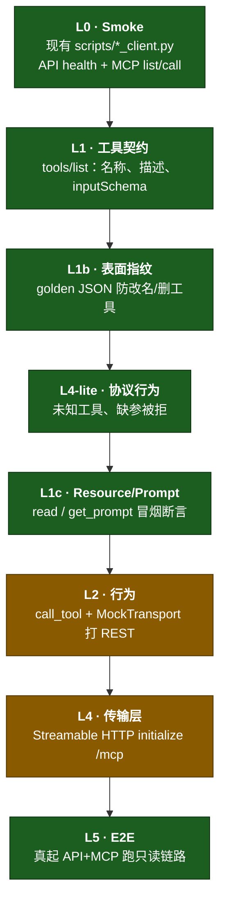
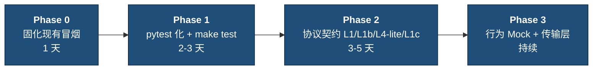

# my-mcp — MCP / API 测试改进计划


## 1. 背景：本项目现状

本仓库是一个学习型演示：

```
MCP Client  ──Streamable HTTP──▶  mcp_server (:3001/mcp)
                                        │ httpx
                                        ▼
                                 app FastAPI (:8000) + SQLite
```

- **1 个 MCP Server**：`user-mcp`（`mcp_server/server.py`，MCP Python SDK 2.x `MCPServer`）
- **1 个 REST API**：用户 + 账单（`app/`）
- **传输**：Streamable HTTP（`http://127.0.0.1:3001/mcp`）
- **当前测试形态**：`scripts/` 下的手动冒烟脚本（非 pytest / 无 CI）

### 1.1 现有脚本一览

| 脚本 | 测什么 | 前置 |
|---|---|---|
| `scripts/test_user_client.py` | REST：注册 / 登录 / me / 改资料 | API `:8000` |
| `scripts/test_bill_client.py` | REST：账单 CRUD / 分享 / 点赞 | API `:8000` |
| `scripts/test_mcp_user_client.py` | MCP：用户 tools / resources / prompts | API + MCP |
| `scripts/test_mcp_bill_client.py` | MCP：账单 tools / resources / prompts | API + MCP |
| `scripts/http_helpers.py` | REST 测试公共工具 | — |
| `scripts/mcp_helpers.py` | MCP 测试公共工具 | — |

本地已验证：上述四个客户端脚本均可跑通。

### 1.2 结论（对照原「多 Server」文档）

| 原文档关注点 | 本仓库现状 |
|---|---|
| 多个 Server、统一 `make test`、CI 缺口 | 单 Server；尚无 Makefile / pytest / CI |
| L1–L4 协议层契约测试 | **缺失**（仅有端到端冒烟脚本） |
| Resource / Prompt 冒烟 | MCP 脚本里有手工调用，**未参数化、未断言 schema** |
| 权限 / 传输层（401、initialize） | **缺失** |
| 工具表面 golden 指纹 | **缺失** |

**缺的不是「再写几个 curl」**，而是：可重复的 pytest 套件、MCP 协议层断言，以及一条命令跑全量。

---

## 2. 目标与成功标准

| 目标 | 验收标准 |
|---|---|
| 一条命令跑全量 | 根目录 `make test`（或 `pytest`）覆盖 REST + MCP；新人 5 分钟可上手 |
| MCP 三要素都被测到 | Tools / Resources / Prompts 都有 list + 至少一次成功调用断言 |
| 协议层有不变量 | `tools/list` 非空；未知工具失败；缺必填参数被拒；资源/提示可 get |
| REST 与 MCP 分离清晰 | `tests/api/` 与 `tests/mcp/` 目录分明；不互相耦合启动方式 |
| 文档与现实一致 | `README.md` + 本文描述的命令真实可跑 |

---

## 3. 本仓库 MCP 表面清单（测试应对齐）

### 3.1 Tools

**用户**

| Tool | REST |
|---|---|
| `register_user` | `POST /api/users/register` |
| `login_user` | `POST /api/users/login` |
| `get_current_user` | `GET /api/users/me` |
| `update_user_profile` | `PATCH /api/users/me` |

**账单**

| Tool | REST |
|---|---|
| `create_bill` | `POST /api/bills` |
| `list_my_bills` | `GET /api/bills` |
| `list_shared_bills` | `GET /api/bills/shared-with-me` |
| `get_bill` | `GET /api/bills/{id}` |
| `update_bill` | `PATCH /api/bills/{id}` |
| `delete_bill` | `DELETE /api/bills/{id}` |
| `share_bill` | `POST /api/bills/{id}/share` |
| `unshare_bill` | `DELETE /api/bills/{id}/share/{username}` |
| `like_bill` | `POST /api/bills/{id}/like` |
| `unlike_bill` | `DELETE /api/bills/{id}/like` |

### 3.2 Resources

| URI | 说明 |
|---|---|
| `user://api/health` | API 健康 |
| `user://docs/overview` | 静态说明 |
| `user://profile/{access_token}` | 当前用户资料 |
| `bill://mine/{access_token}` | 我的账单列表 |
| `bill://shared/{access_token}` | 分享给我的账单 |
| `bill://item/{access_token}/{bill_id}` | 单条账单 |

### 3.3 Prompts

| Prompt | 用途 |
|---|---|
| `welcome_new_user` | 欢迎新用户 |
| `help_update_profile` | 协助改资料 |
| `help_create_bill` | 协助记账 |
| `help_share_bill` | 协助分享 |
| `help_like_bill` | 协助点赞 |

---

## 4. 测试分层（适配本项目）

> 编号沿用原文档 L0–L6 思路，但实现绑定本仓库的 `MCPServer` + Streamable HTTP + FastAPI。



| 层级 | 验证什么 | 本仓库推荐 Harness | 现状 |
|---|---|---|---|
| **L0 Smoke** | API `/health`；MCP 能连上并 `list_tools` | 现有 `scripts/test_*_client.py` | **已有** |
| **L1 工具契约** | 每个 tool：唯一名、描述非空、合法 `inputSchema` | `mcp.client.Client(mcp)` 内存会话，或连真实 `/mcp` | 缺失 |
| **L1b 表面漂移** | tools/resources/prompts 名称集合与 golden 一致 | 提交 `tests/mcp/surface.golden.json` + `UPDATE_GOLDEN=1` | 缺失 |
| **L1c Resource/Prompt** | `read_resource` / `get_prompt` 成功且内容非空 | 同 Client；模板资源需带 token / bill_id | 脚本有调用，缺结构化断言 |
| **L4-lite 协议行为** | 未知 tool 失败；缺必填参数失败；`list_*` 非空 | Client `call_tool` / 非法参数 | 缺失 |
| **L2 行为** | tool 正确调用 REST（URL/method/body）；响应含 `ok` | `httpx.MockTransport` / `respx` 挡在 MCP→API 边界 | 缺失（现为真打 API） |
| **L4 传输层** | Streamable HTTP：`initialize`、错误 JSON、路径 `/mcp` | ASGI / 真实 HTTP 客户端打 `:3001/mcp` | 缺失 |
| **L5 E2E** | 真 API + 真 MCP：注册→登录→记账→分享→点赞 | 现有 `test_mcp_*_client.py`（可迁入 pytest e2e） | **脚本级已有** |
| **L6 Agent 评估** | LLM 是否选对工具（可选） | mcp-eval 等；**不进默认 CI** | 不做（学习项目） |

**经验法则：**

- list / schema / 拒参 / resource·prompt → 优先 **内存 `Client(mcp)`**（不启端口，快）
- 工具是否真打对 REST → **`call_tool` + MockTransport**（L2）
- 传输是否合规 → 真起 MCP 或 ASGI 打 `/mcp`（L4）
- 整链路业务 → 真起 API + MCP（L5 / 现有脚本）

---

## 5. 分阶段计划



### Phase 0 — 固化现有冒烟（已基本完成）

| # | 任务 | 验收 |
|---|---|---|
| 0.1 | REST 拆成 `test_user_client.py` / `test_bill_client.py` | 已完成 |
| 0.2 | MCP 拆成 `test_mcp_user_client.py` / `test_mcp_bill_client.py` | 已完成 |
| 0.3 | README 写清启动与测试命令 | 已完成 |
| 0.4 | 保证脚本失败时 `exit code != 0` | 已完成（REST）；MCP 脚本可再加强显式 assert |

**现在就可以跑：**

```bash
source .venv/bin/activate

# 终端 1
uvicorn app.main:app --host 127.0.0.1 --port 8000 --reload

# 终端 2
python -m mcp_server

# 终端 3
python scripts/test_user_client.py
python scripts/test_bill_client.py
python scripts/test_mcp_user_client.py
python scripts/test_mcp_bill_client.py
```

### Phase 1 — pytest 化 + 一条命令（**已完成**）

| # | 任务 | 状态 |
|---|---|---|
| 1.1 | `requirements-dev.txt`：pytest / pytest-asyncio | **Done** |
| 1.2 | `tests/api/`、`tests/mcp/`、`tests/conftest.py` | **Done** |
| 1.3 | REST 主路径迁入 pytest（`TestClient` + 临时 SQLite） | **Done** |
| 1.4 | `Makefile`：`make test` / `test-api` / `test-mcp` | **Done** |
| 1.5 | MCP 协议层用内存 `Client(mcp)`；scripts 保留作手工 E2E | **Done** |

```bash
source .venv/bin/activate
pip install -r requirements-dev.txt
make test
```

目标树（当前已落地，不含 L2 行为文件）：

```
tests/
├── conftest.py
├── api/
│   ├── test_users.py
│   └── test_bills.py
└── mcp/
    ├── surface.golden.json
    ├── test_tool_contract.py      # L1
    ├── test_surface_drift.py      # L1b
    ├── test_protocol_behavior.py  # L4-lite
    └── test_resources_prompts.py  # L1c
```

### Phase 2 — 协议层（L1 / L1b / L4-lite / L1c）（**已完成**）

| # | 任务 | 状态 |
|---|---|---|
| 2.1 | **L1** `test_tool_contract.py` | **Done** |
| 2.2 | **L1b** `surface.golden.json` + `UPDATE_GOLDEN=1` | **Done** |
| 2.3 | **L4-lite** 未知 tool / 缺参 | **Done** |
| 2.4 | **L1c** health / docs / welcome / help_create_bill | **Done** |

**Golden 示例字段（示意）：**

```json
{
  "tools": [
    "register_user", "login_user", "get_current_user", "update_user_profile",
    "create_bill", "list_my_bills", "list_shared_bills", "get_bill",
    "update_bill", "delete_bill", "share_bill", "unshare_bill",
    "like_bill", "unlike_bill"
  ],
  "resources": [
    "user://api/health",
    "user://docs/overview"
  ],
  "resource_templates": [
    "user://profile/{access_token}",
    "bill://mine/{access_token}",
    "bill://shared/{access_token}",
    "bill://item/{access_token}/{bill_id}"
  ],
  "prompts": [
    "welcome_new_user",
    "help_update_profile",
    "help_create_bill",
    "help_share_bill",
    "help_like_bill"
  ]
}
```

### Phase 3 — 行为 Mock + 传输层

| # | 任务 | 说明 |
|---|---|---|
| 3.1 | **L2**：对 `mcp_server.server._request` / httpx 边界做 Mock | 不断言内部私有函数细节；断言请求 method/path/json |
| 3.2 | **L4**：对 Streamable HTTP 做 `initialize` + 简单 `tools/list` | 可用已启动的 `:3001` 或 ASGI 挂载 |
| 3.3 | （可选）鉴权中间件 | 本学习项目 MCP 本身不强制 HTTP Bearer；业务鉴权在 tool 参数 `access_token` 中。若日后给 `/mcp` 加网关鉴权，再补 L3 |
| 3.4 | 覆盖率门槛（可选） | 例如 MCP server 模块 ≥ 70% |

---

## 6. 推荐测试写法（本仓库）

### 6.1 REST（无需起服务）

```python
from fastapi.testclient import TestClient
from app.main import app

client = TestClient(app)

def test_health():
    r = client.get("/health")
    assert r.status_code == 200
```

### 6.2 MCP 内存客户端（协议层，快）

```python
import pytest
from mcp.client import Client
from mcp_server.server import mcp

@pytest.mark.asyncio
async def test_list_tools_not_empty():
    async with Client(mcp) as client:
        tools = await client.list_tools()
        names = {t.name for t in tools.tools}
        assert "login_user" in names
        assert "create_bill" in names
```

### 6.3 MCP E2E（需 API + MCP 进程）

保留现有脚本，或：

```bash
pytest -m e2e
```

fixture 读取 `API_BASE_URL` / `MCP` URL；默认本地：

- API：`http://127.0.0.1:8000`
- MCP：`http://127.0.0.1:3001/mcp`

---

## 7. 不要做的事（对本学习项目）

| 避免 | 原因 |
|---|---|
| 把 L6 Agent/LLM 评估塞进默认测试 | 慢、贵、不稳定；与 Server 正确性无关 |
| 仅靠 MCP Inspector 当「测试通过」 | 无法进自动化；只适合手工探索 |
| 在 L1–L4 再引入多余第三方 MCP 测试客户端 | SDK 自带 `Client` 已够用 |
| 测试里打印完整 JWT / 写入日志明文 token | 用现有 `redact` 习惯；断言时只检查字段存在 |
| 复制原多 Server 仓的 Jenkins / LRAuth / Prometheus 方案 | 与本仓库无关 |

---

## 8. 验收清单（Definition of Done）

- [x] `make test`（或等价）一条命令跑通默认套件  
- [x] `tests/api/` 覆盖用户 + 账单主路径  
- [x] `tests/mcp/` 至少包含 L1 + L4-lite + L1c  
- [x] golden 表面文件已提交；改 tool 名会失败  
- [x] README / 本文命令与仓库一致  
- [x] 现有 `scripts/*_client.py` 仍可作手工 E2E  
- [ ] Phase 3：L2 MockTransport / L4 真传输（未做）

---

## 9. 与 README 的关系

- **日常怎么跑**：看 `README.md`  
- **测试怎么演进、测哪一层**：看本文  

当前手工冒烟以 README「本地验证」为准；协议层与 pytest 落地后，把 README 的测试小节更新为 `make test` 为主、scripts 为辅。
